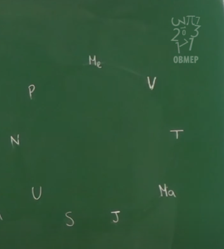
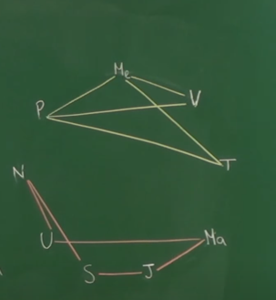

# Um estudo da Teoria dos Grafos

* *Este é um documento para fins de estudos feito por mim (Bruno), para mim (Bruno também). Caso haja erros na matéria ou erros ortográficos abra uma issue que corrijirei.*

* O problema é baseado na cidade de Königsberg (território da Prússia até 1945, atual Kaliningrado), que é cortada pelo Rio Prególia, onde há duas grandes ilhas que, juntas, formam um complexo que na época continha sete pontes, conforme mostra a figura.

* **Discutia-se nas ruas da cidade se existia a possibilidade de atravessar todas as pontes sem repetir nenhuma.**

* Imagem:
   * 

* O impasse foi resolvido por Leonhard ***Euler***, que em *1736*, provou que não existia caminho que possibilitasse tais restrições.
* Euler usou um raciocínio muito simples. Transformou os caminhos em linhas e suas intersecções em pontos, criando possivelmente o primeiro grafo da história.

--- 

## O que são grafos e como são definidos:

* Grafos são uma forma de organizar dados, definida a partir de um conjunto de vértices/nós e um conjunto de arestas são utilizadas para ligar 2 vértices.

* Quando o problema se trata de relações entre elementos, representaremos os elementos por pontos e as relações por linhas.
   * *Pontos* = Vértices
   * *Linhas* = Arestas

* Quando temos apenas uma ou nenhuma ligação entre os vértices é chamado de ***grafo simples***.
* Quando tempos mais de uma ligação por vértice chamamos de ***multigrafos***.
* Quando um vértice está ligado a ele mesmo o chamamos de ***loop***

---

* ### Um grafo simples é composto por:
   * Conjunto de vértices (V)
   * Conjunto de Elos (E) (são as ligações entre os pontos)

#### Um exemplo bem simples:
   * Um exemplo tirado de um vídeo no youtube, do canal "Programa de Iniciação Cientifica da OBMEP".
   * [Clique aqui para acessar](https://www.youtube.com/watch?v=fLNQfhpv-js&list=PLrVGp617x0hAm90-7zQzbRsSOnN2Vbr-I&index=2).

* No ano 3000 será possivel viajar entre os seguintes planetas: Terra-Mercurio; Plutão-Vênus; Terra-Plutão; Plutão Mercúrio; Mercúrio-Vênus; Urano-Netuno; Netuno-Saturno; Saturno-Júpiter, Júpiter-Marte; Marte-Urano
   * **Será possível viajar da Terra para Marte?**

* Este problema não existe necessariamente o uso de grafos, mas utilizá-los facilitará muito. Podemos pensar em cada planeta como vértices, e cada viagem entre eles uma aresta.

* *Representando os planetas:*
   * 

* Com os planetas representados, podemos começar a ligar as arestas (as viagens entre eles)
* *Ligando todos, temos o seguinte grafo:*
   * 

* **Com uma representação visual simples percebemos que é impossível chegar da Terra até Marte pelas trajetórias apresentadas no problema. Este é o poder que um grafo nos dá.**

---

# Fontes

* [Wikipedia](https://pt.wikipedia.org/wiki/Sete_pontes_de_K%C3%B6nigsberg)
* [Programa de Iniciação Cientifica da OBMEP](https://www.youtube.com/watch?v=Frmwdter-vQ&list=PLrVGp617x0hAm90-7zQzbRsSOnN2Vbr-I&index=1)
